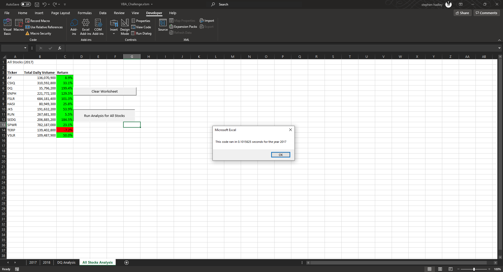
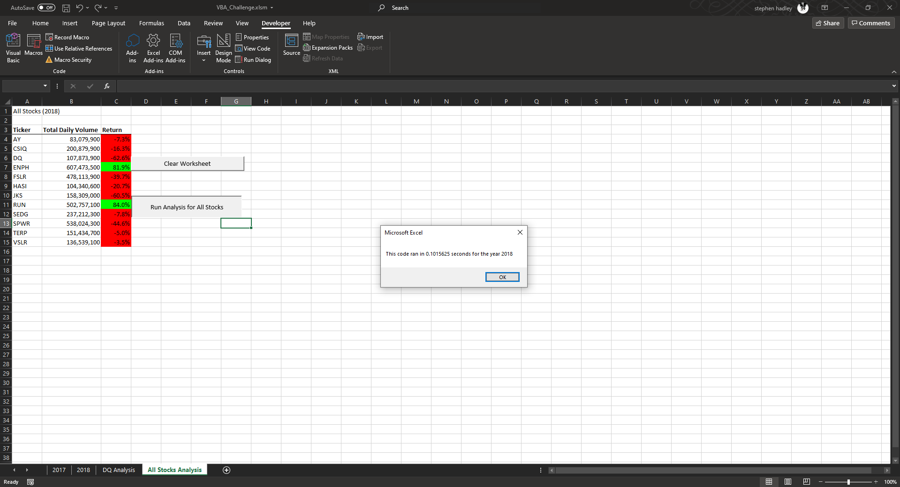
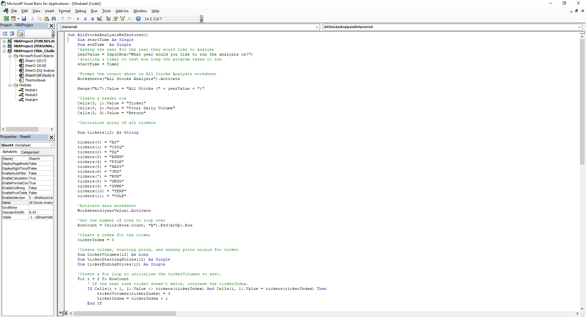
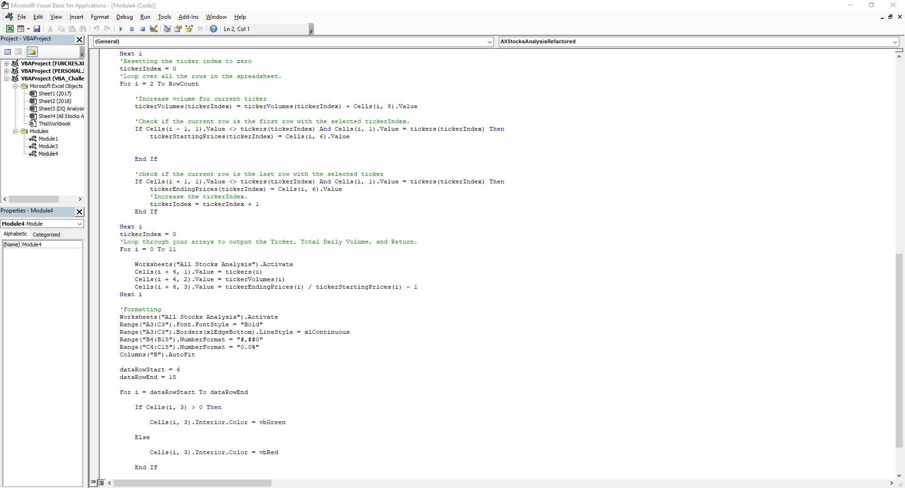
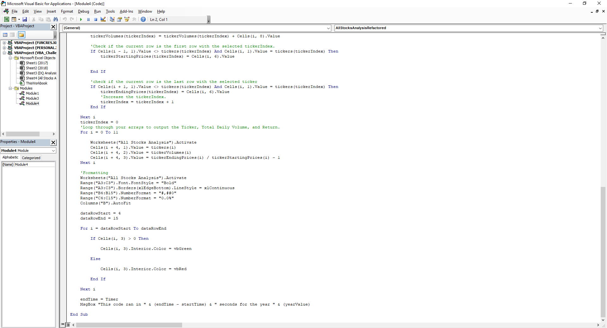

# stock_analysis
---
## The analysis in this project is to find important information in the stock market, there are year sheets and we need to analyze the stocks in the year the user specified to find things like total daily volume, and the return percentage. It is important to set the VBA code up in the way that we do so if any new information is added to the excel sheet it can be accessed and analyzed.
---
###In the challenge we went through the already done code is pretty good but can be better, one of the ways to make it better is to make it easily adjustable to more stocks and displaying the data in a very nice and readable fashion. In the challenge there was only the need to account for 12 stocks however it would not be hard to adjust the program to be able to have as many stocks as there are in the stock market.
---

---

---

---

---

---
##Advantages and Disadvantages of Refactoring
---
###Refactoring codee can help in many ways, one of the best things about refactoring is the ability to take code that already works make it more organized and also fix possible bugs that have not been identified yet, some bugs do not appear unless a condition has been met, refactoring code could help prevent this from happening. Refactoting code also makes us proof read the code to make sure the logic is sound, while coding people tend to get in the zone and know what they are doing so they do not need things like comments and logic, it all makes sense at that moment looking back you may see a mistake that you made or may add a comment to help explain a piece of code for your future self when you realized how little it made sense. Refactoring code can also have a few disadvantages such as breaking the code that did work, going back to make your code better could end up only making the code have more bugs if it is due to a lack of comments or misunderstanding what was being worked towards, it can happen to the best of us and does.
---
##The Original VBA Script Pros and Cons vs Refactorted Script
---
###The original script is does not really have any pros honestly, the best thing I could say is it is highly specified to the sheets that are given. Cons for the original script is the runtime is very slow, if there was more data then the program would take a very long time to execute entirely through. The refactored script as stated in the paragraph above has many pros the best one is the reduction in runtime went from .6 seconds to around .1 seconds this is a big jump espeacially with larger sets of data to sort through. Cons are the multiple ways that you could change the code with the freedom coding gives people you could end up making the script less efficient than before.
